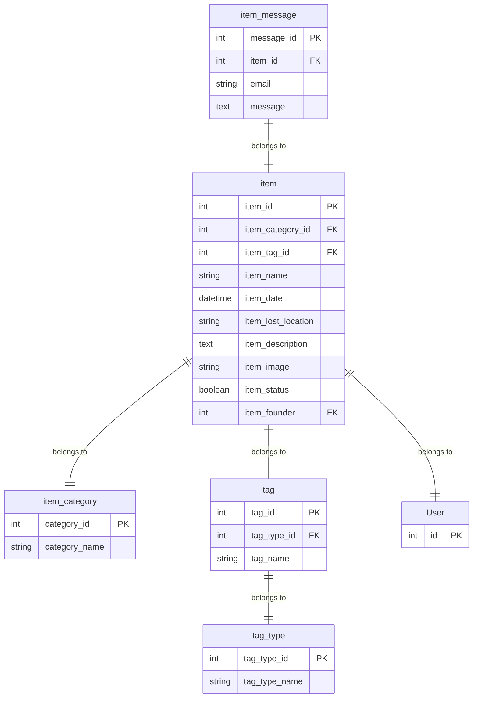

# Entity Relationship Diagram

```mermaid
erDiagram
    item {
        int item_id PK
        int item_category_id FK
        int item_tag_id FK
        string item_name
        datetime item_date
        string item_lost_location
        text item_description
        string item_image
        boolean item_status
        int item_founder FK
    }
    item_category {
        int category_id PK
        string category_name
    }
    tag {
        int tag_id PK
        int tag_type_id FK
        string tag_name
    }
    tag_type {
        int tag_type_id PK
        string tag_type_name
    }
    item_message {
        int message_id PK
        int item_id FK
        string email
        text message
    }
    User {
        int id PK
    }

    item ||--|| item_category : "belongs to"
    item ||--|| tag : "belongs to"
    item ||--|| User : "belongs to"
    tag ||--|| tag_type : "belongs to"
    item_message ||--|| item : "belongs to"

```